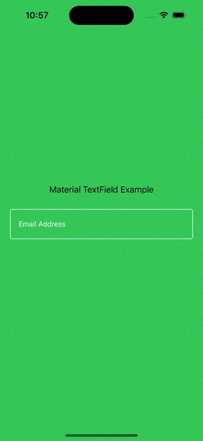

# MaterialTextField-iOS

`MaterialTextField-iOS` is a lightweight iOS text field library that provides Material-style inputs with floating placeholders, underline/outlined styles, and configurable state colors.

## Features

- `MaterialTextField` (`UITextField` subclass) with built-in floating placeholder behavior
- `MTTextInputControllerUnderline` and `MTTextInputControllerOutlined` styles
- Active, normal, disabled, and error state handling
- Built-in clear button and underline helper labels
- Storyboard-friendly usage

## Requirements

- iOS 13.0+
- Swift 6.1+
- Xcode 15+

## Installation

### Swift Package Manager

In Xcode:

1. Open your project.
2. Go to **File > Add Package Dependencies...**
3. Add this repository URL.
4. Select the `MTTextField` product.

Or add it to your `Package.swift` dependencies:

```swift
dependencies: [
    .package(url: "https://github.com/<your-org-or-username>/MaterialTextField-iOS.git", branch: "main")
]
```

Then include the product in your target:

```swift
.target(
    name: "YourApp",
    dependencies: [
        .product(name: "MTTextField", package: "MaterialTextField-iOS")
    ]
)
```

## Quick Start

### 1) Import and connect your text field

Use `MaterialTextField` in Storyboard (custom class) or create it in code, then import:

```swift
import UIKit
import MTTextField
```

### 2) Attach a controller style

```swift
final class ViewController: UIViewController {
    @IBOutlet weak var emailTextField: MaterialTextField!
    private var emailTextFieldController: MTTextInputControllerOutlined?

    override func viewDidLoad() {
        super.viewDidLoad()
        setupEmailField()
    }

    private func setupEmailField() {
        emailTextFieldController = MTTextInputControllerOutlined(textInput: emailTextField)

        emailTextFieldController?.placeholderText = "Email Address"
        emailTextFieldController?.activeColor = .white
        emailTextFieldController?.normalColor = .white
        emailTextFieldController?.floatingPlaceholderActiveColor = .white
        emailTextFieldController?.floatingPlaceholderNormalColor = .white

        emailTextField.textColor = .white
        emailTextField.tintColor = .white
    }
}
```

## Available Controllers

- `MTTextInputControllerUnderline`: Material underline style
- `MTTextInputControllerOutlined`: Material outlined style

## Common Customization

- `placeholderText`
- `activeColor`
- `normalColor`
- `floatingPlaceholderActiveColor`
- `floatingPlaceholderNormalColor`
- `setErrorText(_:errorAccessibilityValue:)` for validation/error state

## Sample App

A storyboard-based sample is included at:

`MaterialTextFieldSample/MaterialTextFieldExampleStoryboard`

To run:

1. Open `MaterialTextFieldSample/MaterialTextFieldExampleStoryboard/MaterialTextFieldExampleStoryboard.xcodeproj`.
2. Select an iOS simulator.
3. Build and run.

## Screenshot


